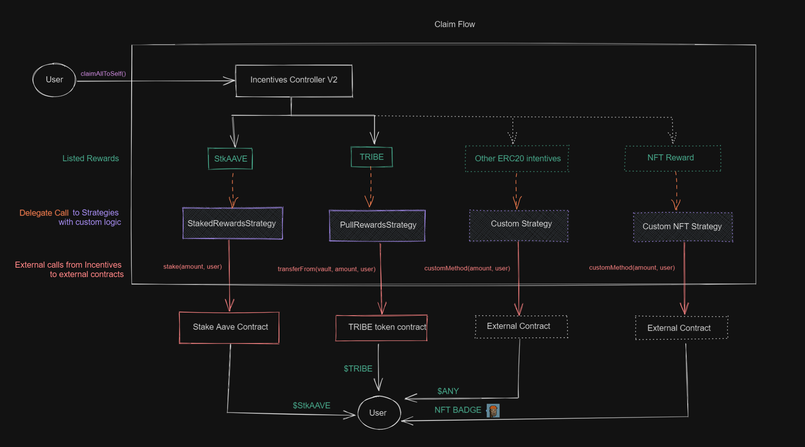

# Rewards Controller

## Introduction

The Rewards Controller and Rewards Distributor contracts are aimed to bootstrap and incentive liquidity of deposits and borrows in the different Aave Markets with support of multiple rewards instead of only one as the previous version.

The `RewardsController` contract is responsible of configuring the different rewards and the claim process. Inherits `RewardsDistributor`.

The `Transfer Strategies` are small implementation contracts that manages the procedure of the rewards transfer at claim. This allows the RewardsController to support any custom rewards, from Staked Aave incentives, common ERC20 transfers from vaults, or even NFT rewards.

The `RewardsDistributor` abstract contract manages the distribution and accountability logic of the multiple rewards per asset over time.

## Rewards Controller

The Rewards Controller is the main contract and where the user interacts to claim the rewards of their positions. It inherits `RewardsDistributor` to handle the distribution of rewards. The users of the incentivised ERC20 assets will accrue value if they hold their tokens in possession without the need of staking or blocking the assets inside a contract. At every transfer the asset must call the `handleAction` method to account the rewards of the user.

## Methods

### setClaimer

Whitelists an address to claim the rewards on behalf of another address

##### Interface

`function setClaimer(address user, address claimer) external;`

##### Input parameters

| Parameter Name | Type    | Description                |
| -------------- | ------- | -------------------------- |
| user           | address | The address of the user    |
| claimer        | address | The address of the claimer |

### setTransferStrategy

Add a TransferStrategy contract that determines the logic and the source of the rewards transfer

##### Interface

`function setTransferStrategy(address reward, ITransferStrategyBase transferStrategy) external;`

##### Input parameters

| Parameter Name   | Type    | Description                                   |
| ---------------- | ------- | --------------------------------------------- |
| reward           | address | The address of the reward token               |
| transferStrategy | address | The address of the TransferStratregy contract |

### setRewardOracle

Sets an Aave Oracle contract to enforce rewards with a source of value.

At the moment of reward configuration, the Incentives Controller performs a check to see if the reward asset oracle is compatible with IEACAggregator proxy.

This check is enforced for integrators to be able to show incentives at the current open source Aave UI without the need to setup an external price registry.

##### Interface

` function setRewardOracle(address reward, IEACAggregatorProxy rewardOracle) external;`

##### Input parameters

| Parameter Name | Type                | Description                                                                |
| -------------- | ------------------- | -------------------------------------------------------------------------- |
| reward         | address             | The address of the reward to set the price aggregator                      |
| rewardOracle   | IEACAggregatorProxy | The address of price aggregator that follows IEACAggregatorProxy interface |

### getRewardOracle

Get the price aggregator oracle address

##### Interface

`function getRewardOracle(address reward) external view returns (address);`

##### Input parameters

| Parameter Name | Type    | Description                     |
| -------------- | ------- | ------------------------------- |
| reward         | address | The address of the reward token |

#### Returns

| Type    | Description               |
| ------- | ------------------------- |
| address | The address of the oracle |

### getClaimer

Returns the whitelisted claimer for a certain address. It returns 0x0 address if not set.

##### Interface

`function getClaimer(address user) external view returns (address);`

##### Input parameters

| Parameter Name | Type    | Description             |
| -------------- | ------- | ----------------------- |
| user           | address | The address of the user |

#### Returns

| Type    | Description                           |
| ------- | ------------------------------------- |
| address | The address of the authorized claimer |

### getTransferStrategy

Returns the Transfer Strategy implementation contract address being used for a reward address

##### Interface

`function getTransferStrategy(address reward) external view returns (address);`

##### Input parameters

| Parameter Name | Type    | Description               |
| -------------- | ------- | ------------------------- |
| reward         | address | The address of the reward |

### configureAssets

Configure assets to incentivize with an emission of rewards per second until the end of distribution.

##### Interface

`function configureAssets(RewardsDistributorTypes.RewardsConfigInput[] memory config) external;`

##### Input parameters

| Parameter Name | Type                                                | Description                    |
| -------------- | --------------------------------------------------- | ------------------------------ |
| config         | RewardsDistributorTypes.RewardsConfigInput[] memory | The assets configuration input |

The `RewardsDistributorTypes.RewardsConfigInput` struct is composed with the following fields:

| Name              | Type                | Description                                                                                                                                                   |
| ----------------- | ------------------- | ------------------------------------------------------------------------------------------------------------------------------------------------------------- |
| emissionPerSecond | uint104             | The emission per second following rewards unit decimals.                                                                                                      |
| totalSupply       | uint256             | The total supply of the asset to incentivize                                                                                                                  |
| distributionEnd   | uint40              | The end of the distribution of the incentives for an asset                                                                                                    |
| asset             | address             | The asset address to incentivize                                                                                                                              |
| reward            | address             | The reward token address                                                                                                                                      |
| transferStrategy  | ITransferStrategy   | The TransferStrategy address with the install hook and claim logic.                                                                                           |
| rewardOracle      | IEACAggregatorProxy | The Price Oracle of a reward to visualize the incentives at the UI Frontend. Must follow Chainlink Aggregator IEACAggregatorProxy interface to be compatible. |

### handleAction

Called by the corresponding asset on transfer hook to update the rewards distribution of an user.

##### Interface

`function handleAction(address user, uint256 userBalance, uint256 totalSupply) external;`

##### Input parameters

| Parameter Name | Type    | Description                   |
| -------------- | ------- | ----------------------------- |
| user           | address | The address of the user       |
| userBalance    | uint256 | The user balance of the asset |
| totalSupply    | uint256 | The total supply of the asset |

### claimRewards

Claims reward for an user to the desired address, on all the assets of the lending pool, accumulating the pending rewards

#### Interface

`function claimRewards( address[] calldata assets, uint256 amount, address to, address reward ) external returns (uint256);`

#### Input parameters

| Parameter Name | Type               | Description                                                            |
| -------------- | ------------------ | ---------------------------------------------------------------------- |
| assets         | address[] calldata | List of assets to check eligible distributions before claiming rewards |
| amount         | uint256            | Amount of rewards to claim                                             |
| to             | address            | Address that will be receiving the rewards                             |
| reward         | address            | Address of the reward token                                            |

## Transfer Strategies

Transfer Strategies are isolated contracts to manage and support different reward systems. Currently there is `StakedTokenStrategy` to support StkAave rewards, and `PullRewardsStrategy` to support common ERC20 incentives pulled from a external vault. The `RewardsController` performs calls to the transfer strategy contracts. The Transfer Strategies has one main function:

- `performTransfer(address to, address reward, uint256 amount)`
  The `performTransfer` function hook is called at `claimRewards`, and holds the custom logic to transfer the rewards from the source of the reward to the destination.

Due they are inmmutable contracts, the transfer strategy contracts contains an ERC20 recovery method in case of a transfer mistake to the contracts.

### Supported Transfer Strategies

#### Pull Rewards Transfer Strategy

The strategy contract allows to integrate any ERC20 token that want to incentivize deposits or borrows at Aave markets. At the deployment you must provide the "vault" address where to pull rewards at the moment of claim.

At transfer hook, does a external call `transferFrom` to the ERC20 token, from the `vault` address to the claimer address.

#### Staked Token Transfer Strategy

The strategy contract allows to integrate the Staked Aave token as rewards. The strategy needs AAVE to be deposited at the Incentives Controller V2 proxy contract. At the deployment you must provide the Stake Aave token address.

At transfer hook, stakes the AAVE rewards while transferring the obtained stkAAVE to the claiming user.

## RewardsDistributor [wip]
