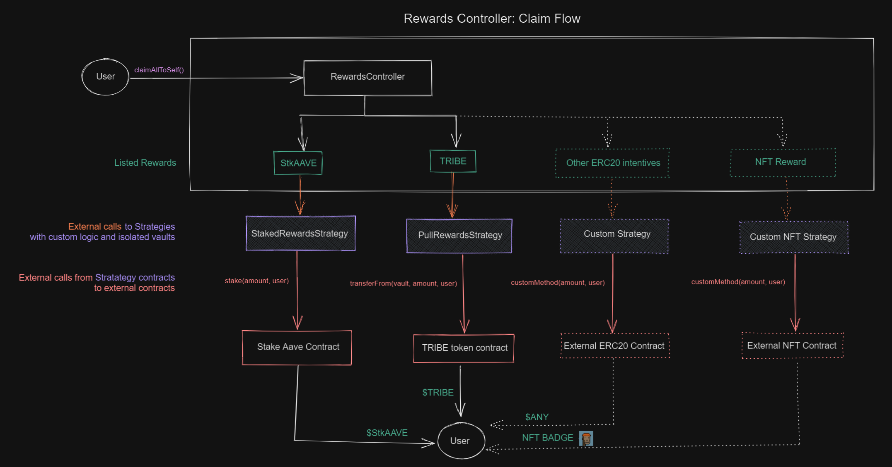

# Transfer Strategies

## Introduction

Transfer Strategies are isolated contracts to manage and support different reward systems. Currently there is `StakedTokenStrategy` to support StkAave rewards, and `PullRewardsStrategy` to support common ERC20 incentives pulled from a external vault. The `RewardsController` performs external calls to the transfer strategy contracts. The Transfer Strategies has one main mandatory function:

- `performTransfer(address to, address reward, uint256 amount)`
  The `performTransfer` function hook is called at `claimRewards`, and holds the custom logic to transfer the rewards from the source of the reward to the destination.

Due they are inmmutable contracts, the transfer strategy contracts contains an ERC20 recovery method in case of a transfer mistake to the contracts.

## Supported Transfer Strategies

### Pull Rewards Transfer Strategy

The strategy contract allows to integrate any ERC20 token that want to incentivize deposits or borrows at Aave markets. At the deployment you must provide the "vault" address where to pull rewards at the moment of claim.

At transfer hook, does a external call `transferFrom` to the ERC20 token, from the `vault` address to the claimer address.

The `vault` must perform an ERC20 approval to the PullRewardsTransferStrategy contract to transfer the rewards on behalf of the strategy contract at `performTransfer` hook.

### Staked Token Transfer Strategy

The strategy contract allows to integrate the Staked Aave token as rewards. The strategy needs AAVE to be deposited at the Staked Token Transfer Strategy contract. At the deployment you must provide the Stake Aave token address.

At transfer hook, stakes the AAVE rewards while transferring the obtained stkAAVE to the desired user.
